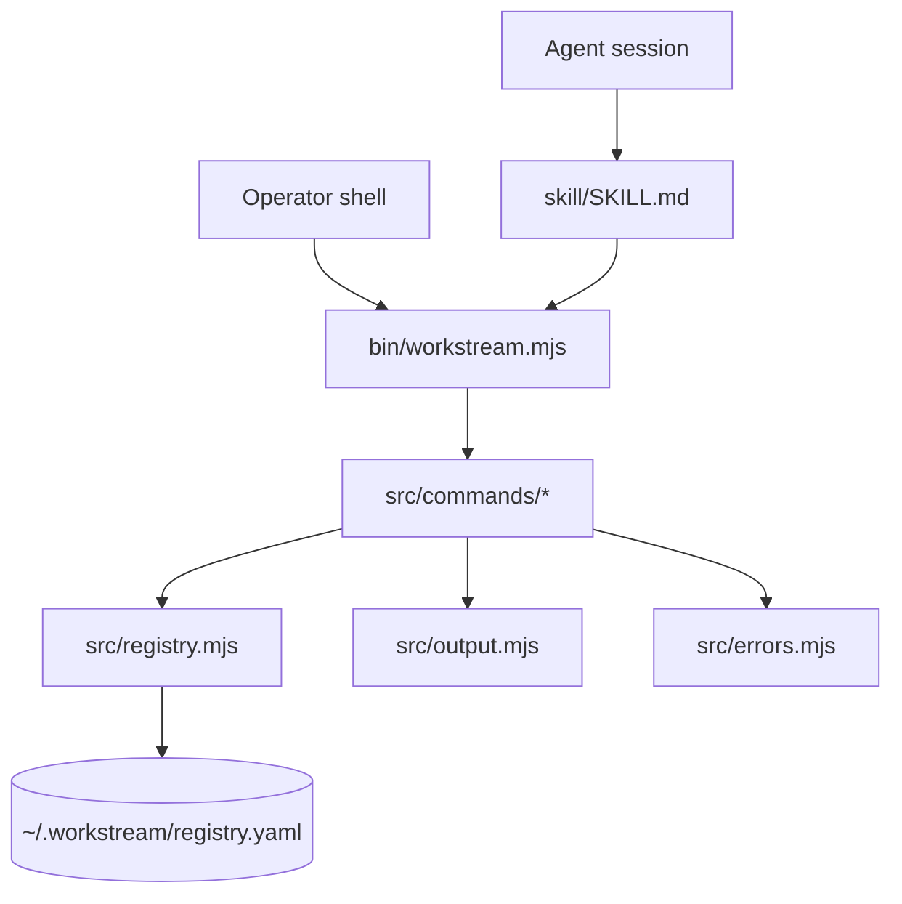
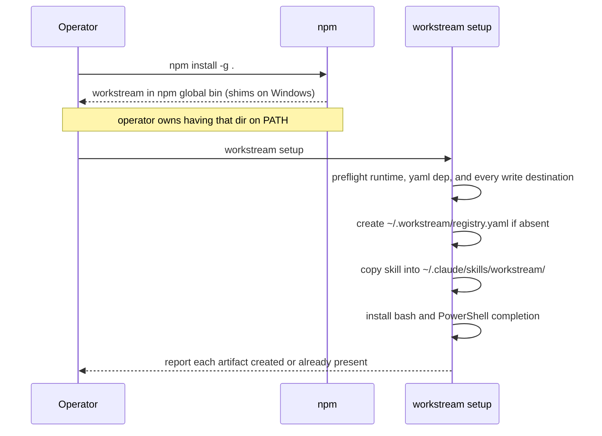
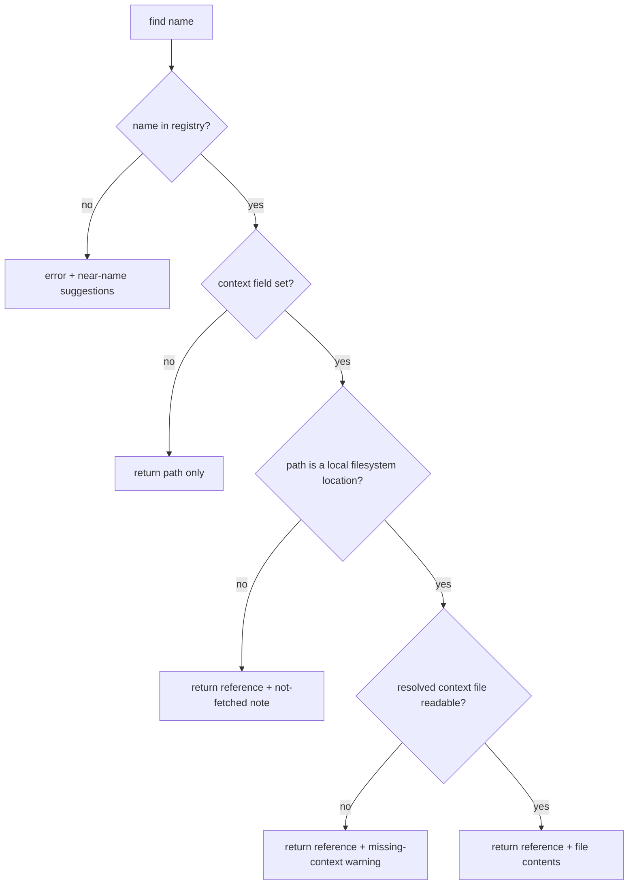

# Workstream Skill - Plan

## Goal Capsule

**Objective:** An operator working in any project folder — on Linux, macOS, or native Windows — can name a workstream and have their agent load that workstream's context without knowing where it lives.

**Means:** A Node CLI distributed through npm (KTD1), with an agent skill layered over the same core module (Key Decision: one implementation shared by the CLI and the agent skill, governing R4-R9).

**Product Authority:** VISION.md, then README.md's schema, then this plan. Where they disagree, the earlier one wins.

**Stop conditions:** Stop and re-plan if the work starts to require a schema beyond the four documented fields, auto-discovery of workstreams, or a tool to make a registry entry readable by a human. Also stop if native Windows support needs more than the reasoned npm and Node behavior this plan assumes — a hand-rolled installer, an elevated-permission workaround, or per-shell logic beyond what npm and the runtime's home-directory API provide.

**Open Blockers:** None.

---

## Product Contract

**Product Contract preservation:** changed — R4, R7, R11, plus new R14-R18. R4 widened from registry creation to full installation (user-confirmed). R7 clarified so a non-local `path` returns a reference instead of failing. R11 widened from one shell to bash and PowerShell. R1-R3, R5, R6, R8-R10, R12, R13 unchanged.

### Summary

A `workstream` command and a matching agent skill, sharing one core module, operating on a flat YAML registry at `~/.workstream/registry.yaml`. Installation runs through npm so the command reaches PATH on every target platform; `workstream setup` then creates the registry, installs the agent skill, and wires shell completion.

### Problem Frame

An operator runs many repos, tickets, systems, and services. Referencing one from inside another means remembering where it lives and what file explains it. That knowledge sits in the operator's head, so every agent session starts by re-establishing it, and context gets copied between repos instead of pointed at.

### Key Decisions

- Registry lives at `~/.workstream/registry.yaml` (session-settled: user-directed — chosen over a repo-local or versioned location: machine-local, unversioned, reachable from every repo). Governs R1.
- One implementation shared by the CLI and the agent skill (session-settled: user-approved — chosen over parallel implementations: registry operations change in one place). Governs R4-R9.
- Remove requires confirmation, with `-q` to skip it (session-settled: user-approved — chosen over unconditional deletion: safe by default, with an escape hatch for automation). Governs R9.
- Add takes the name positionally and everything else as flags (session-settled: user-approved — chosen over all-flags: the name is the primary identifier). Governs R8.
- Setup owns installation, not just registry creation (session-settled: user-directed — chosen over documenting manual install steps in the README: a new machine has neither the command nor the skill, so registry-only setup cannot bootstrap itself). Governs R14, R15, R16, R18.
- Native Windows is a supported platform (session-settled: user-directed — chosen over supporting only WSL and Git Bash: reach matters more than the added shim and completion work). Governs R11, R17.
- Find returns context contents only when the context file is local (session-settled: user-directed — chosen over erroring on non-local entries: the README's own examples include URLs and ssh-style paths). Governs R7.
- Setup seeds an empty registry carrying a commented example (session-settled: user-directed — chosen over seeding the operator's real repos: adding the first real entry exercises the add path). Governs R4.

### Requirements

**Registry Structure**

R1. The registry lives at `~/.workstream/registry.yaml` — machine-local, unversioned, reachable from any project folder.

R2. An entry has `name` (required), `path` (required), `context` (optional), and `description` (optional), as a flat YAML list with no nesting.

R3. Validation covers presence of the required fields only. Optional fields may be absent.

**Operations**

R4. Setup creates `~/.workstream/` and `registry.yaml` when absent, seeded with a commented example entry and no real entries.

R5. Load parses the registry into memory for the other operations.

R6. List shows entries at varying detail, from names alone through full context paths.

R7. Find locates a workstream by name and returns a structured response carrying its path and context reference. It includes the context file's contents when that file is readable on the local filesystem, and the reference alone otherwise. A non-local path is never an error.

R8. Add appends an entry. The name is positional; `--path`, `--context`, and `--desc` are flags.

R9. Remove deletes an entry. It confirms by default; `-q` skips the confirmation.

**UX**

R10. An error states what failed, then states a resolution path when one exists.

R11. Tab completion for workstream names works in bash and in PowerShell.

R12. Add and remove print a confirmation naming the entry ("Added heypogi", "Removed heypogi").

R13. List accepts a pattern and shows only matching workstreams.

**Installation and Platform Support**

R14. `npm install -g` places a `workstream` executable in npm's global bin directory on Linux, macOS, and native Windows, generating the `.cmd` and `.ps1` shims Windows needs. Having that directory on PATH is a prerequisite the operator owns, not something this product configures.

R15. Setup copies the agent skill into the user's agent skills directory, overwriting any existing copy when re-run.

R16. Setup verifies prerequisites before it changes anything, and reports each missing one with its resolution path.

R17. Every operation runs on native Windows PowerShell and cmd as well as Linux and macOS. Paths resolve through the runtime's home-directory API rather than a literal `~`.

R18. Re-running setup reports the state of each managed artifact instead of failing.

**Agent Interface**

R19. The installed skill resolves a workstream by name through the CLI and returns the context to the agent session. Installing the skill file is not sufficient — the skill is complete only when a fresh agent session, given a name and no path, loads that workstream's context.

### Success Criteria

- A machine with Node 22, npm, and npm's global bin directory already on PATH reaches a working `workstream find <name>` through `npm install -g .` followed by `workstream setup`, with no further PATH editing.
- A registry hand-edited with comments and blank lines still carries those comments and blank lines after an add and a remove.
- An agent invoking `workstream remove <name>` without `-q` fails with an actionable message rather than waiting on input that will never arrive.
- From a project folder unrelated to the target workstream, a fresh agent session resolves a workstream by name through the skill and loads its context with no path supplied by the operator.

### Scope Boundaries

**In scope:** the `workstream` command with `find`, `add`, `remove`, `list`, and `setup`; the agent skill; the shared core; npm packaging; bash and PowerShell completion.

**Outside this product's identity:** auto-discovery of workstreams; staleness, health, or status tracking; relationship edges between entries; version control of the registry; nested or schema-validated entry formats.

### Deferred to Follow-Up Work

- Publishing the package to the public npm registry. Installation is from a clone (`npm install -g .`) until there is a reason to publish.
- Completion for shells beyond bash and PowerShell.
- Concurrent-write safety beyond atomic replacement. A single operator on one machine does not need locking.
- Removing what setup installed — the skill copy, both completion artifacts, and the profile line. v1 makes those artifacts inert when the command is absent (KTD11) rather than shipping an uninstall surface.
- Fetching context over http(s) or ssh. v1 returns a reference for non-local entries per R7, and the agent fetches it by other means. Three of README.md's seven example entries are non-local, so this bounds what the external, system, and service workstream types get in v1.

---

## Planning Contract

### Key Technical Decisions

KTD1. **Node 22 with npm as both runtime and distribution channel** (session-settled: user-directed — chosen over a single-file Python script and over a zero-dependency Node build: npm generates the `.cmd` and `.ps1` shims Windows needs, which native Windows support otherwise requires hand-rolling per platform). Satisfies R14, R17.

  This is the plan's one real tension with VISION.md's "introduces a dependency on external tooling" resist-signal, which the Goal Capsule ranks above this document. The signal is read as protecting the registry format — a hand-writable file no tool is needed to read or create, which R2 and KTD2 preserve — rather than forbidding the tool itself a runtime. Native Windows support is what makes that tradeoff worth taking.

  Bootstrap boundary: npm places executables in its configured global bin directory but does not add that directory to PATH. Node 22, npm, and a PATH-visible global bin are prerequisites the operator brings; setup verifies them and reports a resolution path rather than trying to edit PATH itself.

KTD2. **The `yaml` package's Document API handles both reads and writes.** `parseDocument` → mutate `contents.items` → `toString` preserves header comments, inline comments, and blank lines, which a plain parse-and-dump destroys. This is what keeps the registry hand-writable through tool-driven edits. That behavior is not part of the package's documented API, so pin the dependency to the exact verified version and keep the comment-preservation tests as the regression detector. Serves R2, R8, R9.

KTD3. **Registry writes are atomic** — write a sibling temp file, then rename over the target. A crash mid-write leaves the previous registry intact rather than a truncated one. Serves R8, R9.

KTD4. **The agent skill is installed by copying, overwritten on every setup run** (session-settled: user-directed — chosen over symlinking: a copy survives the repo moving or being deleted). Serves R15.

KTD5. **Setup is an explicit subcommand, never an npm `postinstall` hook.** A postinstall failure is easy to miss, and install-time side effects on a user's home directory are a poor default. Serves R4, R15, R16.

KTD6. **The remove confirmation refuses to block when stdin is not a TTY.** It exits with an error naming `-q` instead of waiting forever. This is what stops an agent-invoked remove from hanging. Serves R9, R10.

KTD7. **Completion is generated per shell and installed where that shell already looks.** bash reads `${XDG_DATA_HOME:-$HOME/.local/share}/bash-completion/completions/workstream`, confirmed against the local bash-completion 2.11. PowerShell gets a completion script plus a single idempotent line appended to the user's profile. Serves R11.

KTD8. **Tests run on Node's built-in `node --test`, with no dev dependencies** (session-settled: user-directed — chosen over mirroring the pytest layout in the operator's other CLI project: the built-in runner keeps the tool free of external tooling). Serves the Verification Contract.

KTD9. **Add rejects a duplicate name** rather than appending a shadowed second entry, and its error names the remove-then-add path. Lookup is by name, so two entries sharing one name make find ambiguous. Serves R8, R10.

KTD10. **The CLI surface is a fixed contract, not left to the implementer.** List takes three modes — `--names` (one bare name per line), default (name and path), and `--full` (all four fields) — plus `--match <pattern>`, matched case-insensitively as a substring of the name. Find and list both return the same envelope shape: a status, a result body, and a warnings array. The skill and the CLI are two front ends over one core, so an unspecified grammar or envelope lets them drift apart and makes the skill's invocations unverifiable. Serves R6, R7, R13, R19.

KTD11. **Artifacts setup writes are version-stamped and degrade safely when the CLI is absent.** The installed skill copy records the package version it came from, and the CLI prints a one-line re-run reminder when that stamp and the running version diverge. Both completion scripts exit silently when `workstream` is not resolvable. Without this, an `npm install -g` upgrade leaves an agent following the previous version's contract with no signal, and a removed CLI leaves a profile line erroring on every new shell. Serves R11, R15, R18.

### High-Level Technical Design

Directional guidance for review, not implementation specification.

**Component topology.** Both front ends reach the registry through one core; neither talks to the file directly.



**Cold start.** npm owns getting the command onto PATH; setup owns everything under the operator's home directory.



**Find resolution.** The branch that decides whether contents come back, per R7.



### Output Structure

```text
workstream/
  package.json
  bin/
    workstream.mjs
  src/
    cli.mjs
    registry.mjs
    errors.mjs
    output.mjs
    completion.mjs
    commands/
      list.mjs
      find.mjs
      add.mjs
      remove.mjs
      setup.mjs
  skill/
    SKILL.md
  completions/
    workstream.bash
    workstream.ps1
  test/
    helpers/tmpreg.mjs
    registry.test.mjs
    list.test.mjs
    find.test.mjs
    add.test.mjs
    remove.test.mjs
    cli.test.mjs
    setup.test.mjs
    completion.test.mjs
```

The per-unit `**Files:**` lists stay authoritative; adjust this layout if implementation shows a better one.

### Risks & Dependencies

- **PowerShell profile edits are user-visible state.** Appending a completion line to `$PROFILE` touches a file the operator owns. Make the append idempotent, guard it with a marker comment, and report it in setup's output rather than doing it silently.
- **Global npm install can need elevated permissions.** On some setups `npm install -g` writes to a root-owned prefix. Setup's preflight cannot fix this; the failure surfaces from npm, so the README should name the `npm prefix` workaround.
- **`yaml` comment preservation is a load-bearing behavior, not a documented guarantee.** Version 2.9.0 preserves comments through `parseDocument`/`toString` as verified. Pin the major version and cover the behavior with tests so an upgrade that regresses it fails loudly.
- **Native Windows is planned but unverified here.** Every Windows-specific claim in this plan — shim generation, profile path, home-directory resolution, and rename-over-existing write atomicity — was reasoned from npm and Node behavior, not executed on Windows. Rename atomicity is the one most likely to differ: on Windows a rename onto an open file can fail when an editor, antivirus scanner, or sync client holds the target, a failure mode POSIX does not have. Treat the first Windows run as a verification step in its own right.

### Sequencing

U1 scaffolds packaging. U2 builds the core every command needs. U3 and U4 add read and write operations against it and can proceed in parallel once U2 lands. U5 puts the CLI surface over the registry subcommands. U6 writes the skill and U8 builds the completion scripts and their installer; both can proceed in parallel. U7 lands last because it consumes both — it copies U6's skill, calls U8's installer, and registers its own CLI route.

U7 is the only unit that writes outside the repo, so it is deliberately last: everything it installs exists and is tested before it runs.

---

## Implementation Units

### U1. Package scaffold and npm entry point

**Goal:** `npm install -g .` produces a working `workstream` command on PATH.

**Requirements:** R14, R17

**Dependencies:** none

**Files:** `package.json`, `bin/workstream.mjs`, `.gitignore`

**Approach:**
1. Declare the package as an ES module with a `bin` mapping for `workstream`, an `engines` floor of Node 22, and `yaml` pinned to the exact verified version as the sole runtime dependency. Comment preservation is undocumented behavior of that package, so a floating minor could regress it silently — see KTD2.
2. Give `bin/workstream.mjs` a POSIX shebang and keep it a thin delegate to `src/cli.mjs`; npm supplies the Windows shims, so the shebang is not the Windows path.
3. Add `node_modules/` to `.gitignore`.

**Execution note:** This is packaging. Prove it by installing globally and running the command, not by unit tests.

**Test expectation:** none — packaging scaffolding, covered by the install smoke check in Verification.

**Verification:** `npm install -g .` completes, `npm prefix -g` names a directory on PATH, and `workstream --version` prints the package version from a directory other than the repo.

### U2. Registry core: locate, load, validate

**Goal:** One module resolves the registry path, parses it, validates entries, and raises typed errors.

**Requirements:** R1, R2, R3, R5, R10, R17

**Dependencies:** U1

**Files:** `src/registry.mjs`, `src/errors.mjs`, `test/registry.test.mjs`, `test/helpers/tmpreg.mjs`

**Approach:**
1. Resolve the registry path from the runtime's home-directory API per R17, with an environment override so tests point at a temp directory.
2. Parse with the `yaml` Document API per KTD2 and keep the document object available to callers, not just the plain data — the write units need it.
3. Carry an error type holding a code, a message, and an optional resolution action, per R10.
4. Map parse failures onto that error type using the parser's reported line and column.

**Patterns to follow:** The error shape in `itworkboard-cli`'s `src/workboard_cli/errors.py` — code, message, and an action field that carries the resolution path — is the model for R10.

**Test scenarios:**
- Registry file absent: raises a typed error whose action names `workstream setup`.
- Registry file empty: parses to an empty entry list rather than raising.
- Registry containing only comments: parses to an empty entry list.
- Malformed YAML: raises a typed error carrying the failing line number.
- Top-level mapping instead of a list: raises a typed schema error.
- Entry missing `name`: raises a validation error identifying the entry's position.
- Entry missing `path`: raises a validation error identifying the entry's position.
- Entry with only `name` and `path`: validates, with the optional fields absent.
- Well-formed multi-entry registry: returns every entry with fields intact.

**Verification:** The core loads a hand-written registry, and each malformed input produces a typed error with a resolution action instead of a stack trace.

### U3. Read operations: list and find

**Goal:** List and find return structured results, including for entries whose path is not local.

**Requirements:** R6, R7, R13, R10

**Dependencies:** U2

**Files:** `src/commands/list.mjs`, `src/commands/find.mjs`, `src/output.mjs`, `test/list.test.mjs`, `test/find.test.mjs`

**Approach:**
1. List implements the three modes and the `--match` semantics KTD10 fixes, per R6 and R13.
2. Find composes the context reference before reading anything: resolve `context` against `path` when `context` is relative, and treat `context` as the target directly when it is absolute. The composed reference is what R7's readability test applies to — never `path` itself, which is normally a directory.
3. Classify by the composed reference: a readable local file yields contents; a local file that is absent yields the reference plus a missing-context warning; a non-local `path` yields the reference plus a not-fetched note. See the find-resolution diagram.
4. A miss returns near-name suggestions so the error carries a resolution path per R10.
5. Structured responses go through one output module so the skill and the CLI see the same shape.

**Patterns to follow:** The response envelope in `itworkboard-cli`'s `src/workboard_cli/output.py` — a status, a result body, and a warnings list — is the model for find's structured response.

**Test scenarios:**
- List names-only: emits one name per entry and nothing else.
- List default: emits name and path for each entry.
- List full: includes path, context, and description for each entry.
- List `--match` is case-insensitive and matches a substring of the name.
- List with a pattern matching a subset: returns only matching names.
- List with a pattern matching nothing: returns an empty result, not an error.
- List against an empty registry: reports emptiness and names the add command.
- Find a local entry whose context file exists: returns the reference and the file contents.
- Find a local entry whose context file is missing: returns the reference plus a warning, and does not raise.
- Find an entry with no `context` field: returns the path alone.
- Find an entry whose path is an `https://` URL: returns the reference with the not-fetched note.
- Find an entry whose path is `user@host:/dir`: returns the reference with the not-fetched note.
- Find an unknown name: raises a typed error listing near-name suggestions.

**Verification:** Find handles every path shape in README.md's example table without raising, and list's three detail levels differ as described.

### U4. Write operations: add and remove

**Goal:** Add and remove change the registry while preserving hand-written comments and spacing.

**Requirements:** R8, R9, R12, R10

**Dependencies:** U2

**Files:** `src/commands/add.mjs`, `src/commands/remove.mjs`, `test/add.test.mjs`, `test/remove.test.mjs`

**Approach:**
1. Mutate the parsed document's items and re-serialize per KTD2 rather than rebuilding the file from plain data.
2. Write atomically per KTD3. Retry the rename briefly on a lock or permission error before surfacing it: on Windows an editor, antivirus scanner, or sync client holding the target makes rename-over-existing fail transiently, a mode POSIX does not have.
3. Add rejects a duplicate name per KTD9 and requires `--path` alongside the positional name per R8.
4. Remove prompts by default and honors `-q`, and refuses to prompt on a non-TTY stdin per KTD6.
5. Both print the confirmation line required by R12.

**Execution note:** Write the comment-preservation and empty-registry cases as failing tests first — they are the behaviors most likely to regress silently on a dependency upgrade.

**Test scenarios:**
- Add to a registry with a header comment: the header survives verbatim.
- Add to a registry with an inline comment on another entry: that comment survives.
- Add with only the required name and path: writes an entry without the optional keys.
- Add with all flags: writes all four fields.
- Add a name already present: raises a typed error whose action names remove-then-add.
- Add with the positional name but no `--path`: raises a validation error.
- Add prints "Added <name>".
- Remove an existing entry: the entry disappears and surrounding comments survive.
- Remove the only entry: the file stays a valid, hand-editable empty list rather than serializing to inline `[]`.
- Remove with `-q` and a non-TTY stdin: succeeds without prompting.
- Remove without `-q` and a non-TTY stdin: exits with an error naming `-q`, and the registry is unchanged.
- Remove an unknown name: raises a typed error and leaves the file untouched.
- Remove prints "Removed <name>".
- A write interrupted before rename leaves the original registry intact.
- A rename that fails with a lock error retries, then surfaces a typed error naming the holding process if it keeps failing.

**Verification:** A registry hand-written with comments and blank lines survives a full add-then-remove cycle with its comments and spacing intact.

### U5. CLI surface and error rendering

**Goal:** One command routes the registry subcommands and renders errors as message plus resolution path.

**Requirements:** R10, R12, R8, R9, R6, R13

**Dependencies:** U3, U4

**Files:** `src/cli.mjs`, `test/cli.test.mjs`

**Approach:**
1. Parse arguments with Node's built-in argument parser; no CLI framework dependency.
2. Route `find`, `add`, `remove`, and `list`, keeping add's positional-name shape from R8. U7 registers the `setup` route when it builds that handler; do not stub it here.
3. Catch the typed error from U2 at the boundary and render its message, then its action on a following line, per R10.
4. Exit non-zero on error and zero on success, so scripts and agents can branch on it.

**Test scenarios:**
- Each of `find`, `add`, `remove`, and `list` dispatches to its handler with parsed arguments.
- An unknown subcommand prints usage and exits non-zero.
- `--help` lists every subcommand and exits zero.
- A typed error renders both the message and the resolution action.
- An error without an action renders the message alone, with no empty trailing line.
- A successful command exits zero; a failing one exits non-zero.
- Add and remove confirmations reach stdout, while errors reach stderr.
- Find and list emit the envelope shape KTD10 fixes, so the skill and the CLI consume one contract.

**Verification:** `find`, `add`, `remove`, and `list` are reachable from an installed `workstream`, and no failure path prints a raw stack trace.

### U6. Agent skill definition

**Goal:** An agent can carry out every registry operation from natural language.

**Requirements:** R19, R7, R6, R8, R9

**Dependencies:** U5

**Files:** `skill/SKILL.md`

**Approach:**
1. Give the skill frontmatter with `name`, a `description` naming the triggering situations, and `user-invocable: true`, matching the convention in the operator's existing personal skills.
2. Map natural-language intents onto the subcommands from U5 rather than restating registry mechanics — the CLI is the one implementation per the shared-implementation Key Decision.
3. State find's local-versus-remote contract by citing R7, so an agent knows a missing-contents response is expected rather than a failure.
4. State the non-TTY rule from KTD6 so an agent uses `-q` when removing.

**Test expectation:** none — instruction content with no executable behavior. R19 is proved by the agent behavioral check in the Verification Contract, which is the gate that stops an installed-but-inert skill from counting as done.

**Verification:** In a fresh agent session, "what workstreams do I have" and "load the heypogi workstream" both resolve through the CLI without the agent reading the registry file directly.

### U8. Shell completion for bash and PowerShell

**Goal:** Completion scripts for both supported shells, plus the installer function `setup` calls.

**Requirements:** R11, R17

**Dependencies:** U3, U5

**Files:** `completions/workstream.bash`, `completions/workstream.ps1`, `src/completion.mjs`, `test/completion.test.mjs`

**Approach:**
1. Add a hidden subcommand emitting bare names for completion to consume, so neither script parses the registry itself.
2. Install the bash script to `${XDG_DATA_HOME:-$HOME/.local/share}/bash-completion/completions/workstream`, where bash-completion already autoloads from, per KTD7.
3. Install the PowerShell script and append one guarded line to the CurrentUserCurrentHost profile of the PowerShell edition invoking setup, creating the profile file and its parent directory when absent. Guard the line with a marker comment so repeat runs do not duplicate it, per KTD7 and the PowerShell risk above.
4. Export the install step as a function U7 calls, rather than a separate command the operator must remember to run.
5. Complete subcommand names in first position and workstream names after `find` and `remove`.
6. Fail silently when the registry is absent, so an uninstalled registry does not spew errors on every Tab.

**Test scenarios:**
- The hidden name-listing subcommand emits one bare name per line and nothing else.
- It exits zero and emits nothing when the registry is absent.
- It exits zero and emits nothing when the registry is malformed, rather than printing a parse error.
- Completion install writes the bash script to the autoload directory, creating it when absent.
- Completion install appends the PowerShell profile line exactly once across repeated runs.
- Completion install leaves existing unrelated PowerShell profile content intact.
- Completion install creates the PowerShell profile file and its parent directory when neither exists.

**Verification:** In bash, `workstream find <Tab>` offers registered names. In PowerShell, the same completion works in a new session after the profile line is in place.
### U7. Setup: preflight, registry creation, skill install, health check

**Goal:** One command takes a machine that has the `workstream` binary to a fully working install.

**Requirements:** R4, R11, R15, R16, R18, R10, R17

**Dependencies:** U6, U8

**Files:** `src/commands/setup.mjs`, `src/cli.mjs`, `test/setup.test.mjs`

**Approach:**
1. Register the `setup` route in `src/cli.mjs`. U5 deliberately left it unrouted because this handler did not exist yet.
2. Preflight before mutating anything, per R16 and KTD5. Check the Node version floor, that the `yaml` dependency resolves, and that every destination this unit will write is reachable and writable — the registry directory, the skill destination, the bash completion directory, and the PowerShell profile's parent. Report each failure with its resolution path. Validating destinations up front is what makes R16's no-mutation guarantee hold; checking only the runtime lets setup create the registry and then fail mid-install, leaving partial state in the operator's home.
3. Create `~/.workstream/` and a `registry.yaml` containing a commented example and no real entries, per R4.
4. Copy `skill/SKILL.md` to `<home>/.claude/skills/workstream/SKILL.md`, overwriting any existing copy, per KTD4 and R15. That directory-per-skill layout is the convention the operator's existing personal skills already use. Other agent tools' skill directories are out of scope for v1.
5. Call U8's completion installer for both shells, per R11.
6. Resolve every destination through the runtime's home-directory API per R17.
7. Report each managed artifact — registry, skill, bash completion, PowerShell profile line — as created, updated, or already present, which is what makes a re-run a health check per R18.

**Test scenarios:**
- Setup on a home directory with nothing present: creates the registry directory, the registry, the installed skill, and both completion artifacts.
- The created registry parses as an empty entry list and contains the commented example.
- The skill lands at `<home>/.claude/skills/workstream/SKILL.md`, creating intermediate directories.
- Setup registers the `setup` route so `workstream setup` is dispatchable from the installed CLI.
- Setup re-run with everything present: reports each artifact as already present and exits zero.
- Setup re-run with a modified installed skill: overwrites it with the repo copy.
- Setup with an existing registry holding entries: leaves those entries untouched.
- Preflight failure on an unmet Node version: reports the resolution path and makes no filesystem changes.
- Preflight failure on an unresolved `yaml` dependency: reports the resolution path and makes no filesystem changes.
- Preflight failure on an unwritable skill destination: reports the resolution path and makes no filesystem changes, including no registry.
- Setup reports every path it wrote, using the resolved home rather than a literal `~`.

**Verification:** On a machine with no `~/.workstream` and no installed skill, `workstream setup` followed by `workstream list` succeeds, tab completion works in a new shell, and a second `workstream setup` changes nothing and reports so.

### U9. Documentation finalization

**Goal:** README.md tells a new operator how to install the tool and what v1 actually does.

**Requirements:** R14, R17, R7

**Dependencies:** U7

**Files:** `README.md`

**Approach:**
1. Add an Install section: `npm install -g .` from a clone, then `workstream setup`. State that npm's global bin directory must already be on PATH and name `npm prefix -g` as the way to check — this is the operator's prerequisite per KTD1, not something setup configures.
2. Record the Node 22 floor and the native Windows, macOS, and Linux support claim.
3. Note that `find` returns contents for local context files and a reference for URL or ssh-style entries, so the README's own non-local examples are not misread as fully served.
4. Replace the Status section's "Next: build the skill" with the shipped state.

**Execution note:** This lands after U7 so the documented install path is the one that was actually verified, not the one that was planned.

**Test expectation:** none — documentation. Verified by the cold-start smoke gate being reproducible from the README text alone.

**Verification:** A reader who has never seen this repo can install and run `workstream find` using only README.md, on a machine that meets the stated prerequisites.

---

## Verification Contract

| Gate | Command | Applies to |
|---|---|---|
| Unit and integration tests | `node --test` | U2-U5, U7, U8 |
| Upgrade drift | Bump the package version, re-run the CLI, confirm the stale-skill reminder fires; remove the CLI, confirm both completion scripts stay silent | U7, U8 |
| Global install smoke | `npm install -g .` then `workstream --version` from another directory | U1 |
| Cold-start smoke | `workstream setup` then `workstream list` on a home directory with no `~/.workstream` | U7 |
| Round-trip fidelity | Add then remove against a registry carrying comments and blank lines; diff the untouched regions | U4 |
| Agent behavioral check | From an unrelated project folder, a fresh agent session resolves a workstream by name through the skill and loads its context, with no path supplied | U6, R19 |
| Docs reproducibility | Install and run `workstream find` following only README.md | U9 |
| Windows check | Run `node --test`, the install smoke, and the cold-start smoke in both native PowerShell and cmd; run `add`, `remove`, `find`, `list`, and the non-TTY `remove` refusal in both; run the completion check in PowerShell | U1-U8 |

Tests run on Node's built-in runner with no dev dependencies, per KTD8. The Windows row is a manual gate: every Windows-specific behavior in this plan is reasoned rather than executed, per the Risks section.

---

## Definition of Done

**Global**

- Every requirement R1-R18 is either implemented or explicitly deferred in Scope Boundaries.
- `node --test` passes with no skipped tests.
- The install smoke, cold-start smoke, and round-trip fidelity gates pass on the development machine.
- The Windows check has been run at least once, and any gap it exposes is either fixed or recorded as a follow-up.
- README.md carries the install path, prerequisites, and shipped status, per U9.
- No dead-end or experimental code from abandoned approaches remains in the diff.

**Per unit**

A unit is done when its listed test scenarios exist and pass — U1 and U6 declare none and rest on their Verification statements instead — its Verification statement holds, and every file in its `**Files:**` list is either created or deliberately dropped with a note in the commit.
